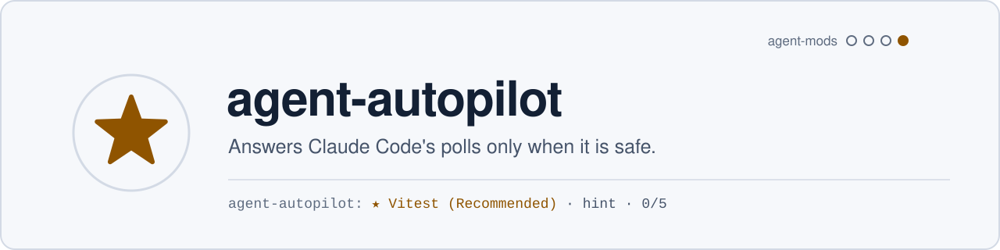
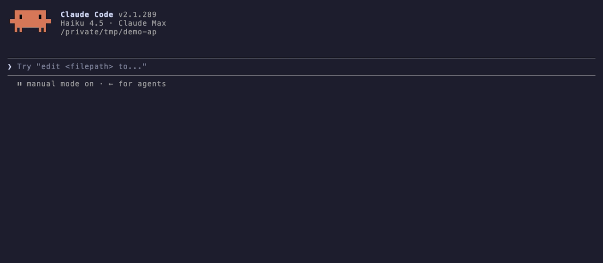

<picture>
  <source media="(prefers-color-scheme: dark)" srcset=".github/assets/banner-dark.svg">
  
</picture>

[](https://github.com/apolenkov/agent-autopilot/actions/workflows/ci.yml)
[](https://github.com/apolenkov/agent-autopilot/actions/workflows/codeql.yml)
[](https://github.com/apolenkov/agent-autopilot/releases)
[](https://scorecard.dev/viewer/?uri=github.com/apolenkov/agent-autopilot)
[](LICENSE)
[](https://claude.com/claude-code)



A Claude Code mod that answers the assistant's `AskUserQuestion` polls for you,
only when the assistant itself marked one option "(Recommended)" and nothing in
the poll looks irreversible. The default mode only hints; it answers for you
when you switch it on, for the current session.

## The rule

A poll is answered by the autopilot only when all of these hold; otherwise it
goes to you as always:

- the assistant raised it (not another mod's `$.ui.ask`);
- it has exactly one question, single choice (no free text, no number, no
  multi-select, no "Other");
- exactly one option has a label matching `/recommend|рекоменд/i`; Claude Code
  writes it in lowercase by convention of the model, not by API; two
  matches mean you decide, and a warning ("not recommended", "не рекомендую")
  is no star;
- nothing in the question, labels, descriptions or previews looks irreversible:
  delete, force-push, publish, deploy, payments, secrets and access, `prod`,
  merge, kill and the like, plus your own words in `extraDeny`. This is a
  keyword gate on the text, not an understanding of intent;
- the limit is not used up, no poll was answered earlier in this turn, and the
  same question text was not already answered automatically this session (a
  repeat means the assistant drifts).

No model decides anything: the rule is deterministic and nothing goes over the
network. On the owner's own 70 polls, following "(Recommended)" matched the
owner's choice in 80% of the 50 polls it covered (71% coverage).

## Modes

| Mode     | What it does                                                                         |
| -------- | ------------------------------------------------------------------------------------ |
| `off`    | nothing                                                                              |
| `hint`   | default: a separate line under the poll, `★ <label>`; the poll stays yours to answer |
| `auto`   | answers for you, tells the assistant it did                                          |
| `shadow` | shows nothing and answers nothing: only writes the star and your pick to the journal |

In `hint` and `auto` the journal records every poll the autopilot sees (the
question, the options, the decision), whether it answered or left the poll to you.
When you answer a poll yourself, the journal also keeps what you picked
(`→ вы: «…»` in `/autopilot last`).

`auto` set with `/autopilot auto` lasts for the session only: a new session
(also after `/clear`) starts again in the mode from the settings (`hint` by
default; a `mode` of `auto` in the settings is your standing choice). The
status line shows it, for example `AP auto 2/5`. The ★ is its own line, not
part of the label.

Commands: `/autopilot status | off | hint | auto | shadow | last | ask`. `last` lists
the journal; `ask` puts the last automatic answer to you again in the engine's
dialog and, if you pick another option, leaves a correction note in the prompt
box for you to send (where there is no dialog, it says so).

## Does the star match your pick?

Work in `shadow` for a while (`"mode": "shadow"` in the settings, or
`/autopilot shadow` for one session): nothing is shown, every poll you answer
is journaled with the star the rule would have put and your own pick. In
`shadow`, `/autopilot last` shows only that a poll was written down: no star,
no pick, so you do not see the hint before the measure is done.

`node scripts/agreement.ts` reads the journals of every session and prints two
blocks. **ЗАМЕР** counts `shadow` polls only: the share where you picked the
starred option, its 95% Wilson interval, the split by number of options, by
whether the star stood first, and by reason, and each poll where you picked
another option. **ПОТОЛОК** counts `hint` and `auto` polls, where the star was
on screen when you picked: it can only run high, and gives no verdict.

Reading the ЗАМЕР: under 30 measured polls the verdict is «мало данных». It is
«достаточно» when the lower bound of the interval is above 80% (observed 90%
needs about 54 polls, 95% about 25, 10 of 10 is not enough: its lower bound is
72%); count polls from 5 sessions or more.

## Limits and honesty

- **No undo.** An automatic answer is an answer: the assistant carries on with
  it, and whatever it then does is not rolled back.
- **Indistinguishable in the transcript.** The tool result looks exactly like
  one you gave. The marker is the note added to the assistant's context
  (`autopilot: ответил по правилу (Recommended): <label>`) and the journal
  (`/autopilot last`); nothing in the transcript tells them apart.
- **Interactive sessions only.** In `claude -p` and in subagents the assistant
  has no `AskUserQuestion`, so there is nothing to answer there. Checked live
  (2.1.289): in `claude -p` the model reports it has no such tool and the mod
  stays silent, with no errors in the log; an agent whose tools list is only
  `AskUserQuestion` is refused by the engine ("not available to subagents").
- **A wrong recommendation stays wrong.** If the assistant recommends badly, the
  autopilot follows it with confidence, up to 5 times per session (`limit`).
  Keep `hint` unless you watch the session.
- **Not a permission tool.** Permission prompts are the job of Claude Code's own
  auto mode; plan approval (`ExitPlanMode`) is never answered.

## Known limits

- **One answer per turn is counted by `turn.start`.** Checked live: a subagent's
  loop does not raise it (a subagent has no AskUserQuestion anyway), but a
  finished background agent starts a new main-thread turn, so the guard resets
  there.
- **`/autopilot ask`** puts the correction note in the prompt box only when the
  engine shows suggestions; otherwise the command reply carries the note to send.

## Install

Claude Code 2.1.289 or newer (mods are on by default).

```sh
claude plugin marketplace add apolenkov/agent-autopilot
claude plugin install agent-autopilot@agent-autopilot
```

Or try a checkout: `claude --plugin-dir /path/to/agent-autopilot`.

## Settings

| Setting     | Default | Meaning                                                                   |
| ----------- | ------- | ------------------------------------------------------------------------- |
| `mode`      | `hint`  | `off`, `hint`, `auto` or `shadow` at the start of a session               |
| `limit`     | 5       | most polls answered for you per session                                   |
| `extraDeny` | empty   | comma-separated words that send a poll to you, added to the built-in list |
| `logSize`   | 100     | journal entries kept per session                                          |

See [SECURITY.md](SECURITY.md) for what it sees and keeps, and
[CONTRIBUTING.md](CONTRIBUTING.md) to work on it.

`engine-types/` holds Claude Code's own API declarations, © Anthropic PBC and not covered by the MIT license; see [engine-types/NOTICE.md](engine-types/NOTICE.md).
